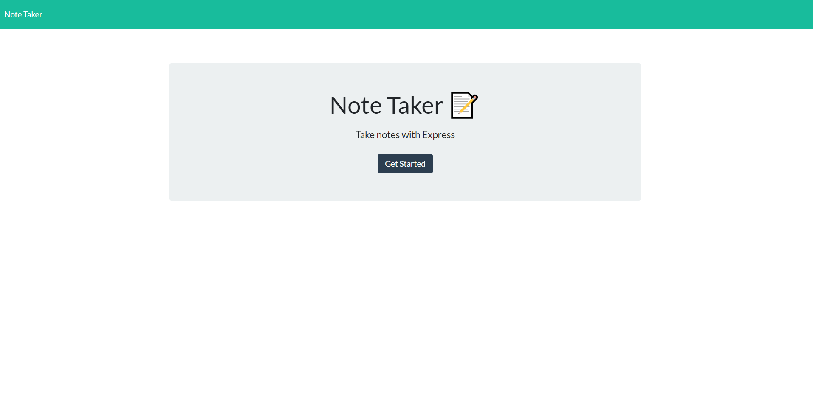
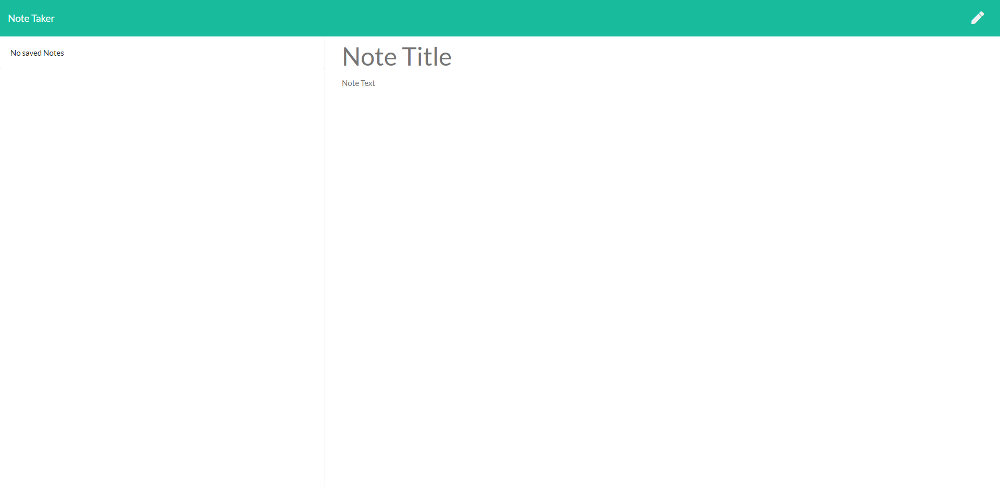
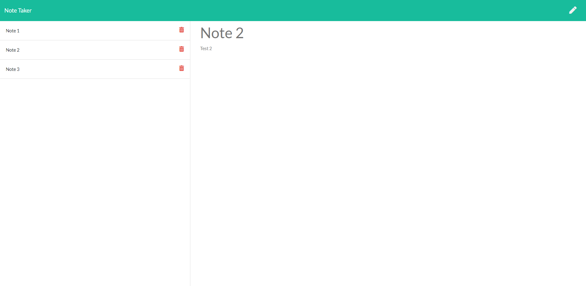

# note-taker

## Summary:

For this project, the front-end code was provided on the source code. Only the back-end code contained in the server.js file was built to support the front-end functionality for the note-taker app application.

The back-end (server.js) was built to handle the different paths and user interactions specified in the requirements.

## Path supported by the Back-end (server.js):

1. GET "*" - Handles all non-supported paths and renders the index.html file.
2. GET "/notes" - Handles the notes path rendering the notes.html file.
3. GET "/api/notes" - Retrieves the notes saved in the database (db.json).
4. POST "/api/notes" - Handles the save note event adding a new note to the database.
5. DELETE /api/notes/:id - Handles the note delete event removing a note from the database using the id assigned to the note when it was created and saved to the database. IDs are created using uuid (https://www.npmjs.com/package/uuid).

## Deployed App Link:

https://desolate-badlands-58847.herokuapp.com/

## Images:

1. Home Page

2. Notes Page

